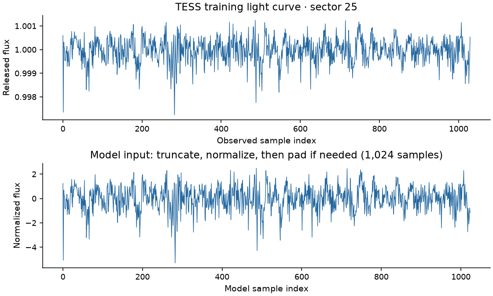
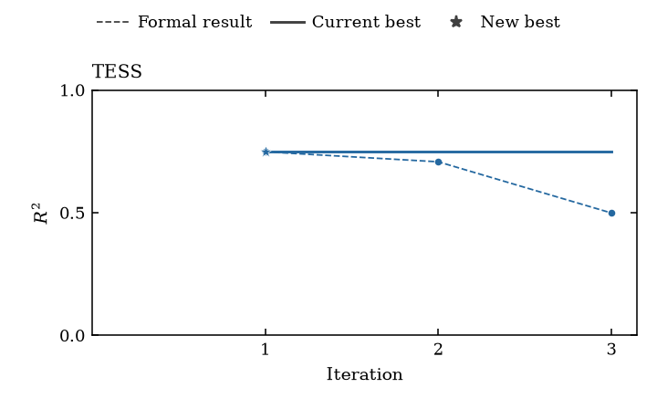
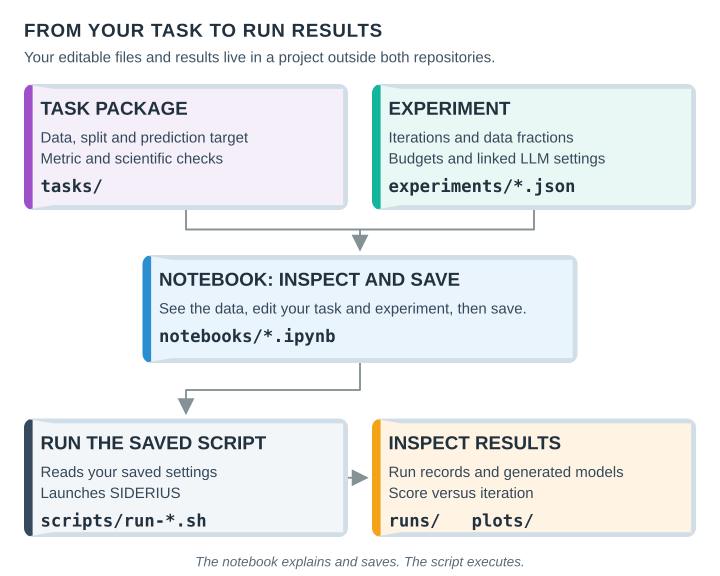

# siderius-exp

Learn to use [SIDERIUS](https://github.com/yuema137/SIDERIUS) on scientific data:
define a prediction task, run a small experiment and inspect what happened.
This repository supplies task packages, tutorials and recorded experiments;
SIDERIUS supplies the execution framework.

## Start with TESS

**Follow the [TESS tutorial](tutorials/paper/tess/README.md).** It predicts stellar
rotation from brightness measurements and uses a small downloadable dataset.
You can browse its notebook before installing anything.

| One real training input | A recorded three-iteration result |
|---|---|
|  |  |

These are genuine archived examples, not your results or promised scores.
Their [source and limitations](tutorials/paper/examples/README.md) remain recorded.
The [tutorial index](tutorials/README.md) has notebook/script demos for all nine
tasks, including detector waveforms, images, graphs and video.

We recommend using your coding agent. Open this repository and say:

```text
Help me run the small TESS tutorial in a new project at /absolute/path/my-tess-demo. Guide me through environment and data setup, explain the saved files, and ask before paid execution.
```

You provide credentials through your environment and decide when to spend API
credit/GPU time. You can follow the same instructions manually.

## Understand the files before running



| Your choice | Where it belongs in your external project |
|---|---|
| Inputs, target, train/validation split, metric and scientific checks | **Task package** |
| Iterations, data fractions, time/VRAM budgets and model routing | **Experiment** and linked configuration |
| Which saved experiment to execute | **Shell script** shown by the notebook |

Changing the split changes the task; keeping that split and running four instead
of three iterations changes the experiment. A notebook variable affects a run
only after it is saved. Each guide shows the actual filenames and launch command.

Your project lives **outside both repositories**. Keep editable tasks, notebooks,
JSON, scripts and results there; keep credentials separately. Start with the
[Luna test configuration](tutorials/shared/README.md). For research, use the
paper's routing as a starting point or choose your own models. Model choice and
training budgets are not a whole-run API spending limit.

## Tutorials and the paper

[Beyond a Better Score: Long-Horizon Agentic ML Development and Evaluation Protocol for Physics Time Series](https://zenodo.org/records/23071121)
introduces SIDERIUS and studies agent-driven development on TIDMAD, TESS,
Project8 and LIGO, including scientific validity and compute budgets.

**Tutorials are simplified process demos, not one-click reproductions of paper
artifacts or scores.** Fresh LLM-driven runs can produce different models and
outcomes. Use the [paper artifact reference](experiments/paper-artifacts.md) for
historical source pairs, configurations, available evidence and their limits.

## Find the right level of detail

| Need | Start here |
|---|---|
| Choose a small demo | [Tutorials](tutorials/README.md) |
| Understand or extend scientific contracts | [Tasks](tasks/README.md) |
| Inspect a workflow treatment or recorded run | [Experiments](experiments/README.md) |
| Coordinate multiple experiments | [Campaigns](campaigns/README.md) |
| Configure an execution environment | [Deployments](deployments/README.md) |
| Contribute code | [Contributor rules](CLAUDE.md) |

<a id="framework-revision"></a>
The framework pin is in [SIDERIUS_REVISION](SIDERIUS_REVISION). Each checkout
needs its own frozen environment. Paper-task demos share a
[paired installation guide](tutorials/shared/setup/README.md); supplementary
guides provide their own complete setup. Historical launchers may have older pins.

<a id="running-the-live-tests"></a>
Developer checks and scientific runs are separate. Follow the
[validation rules](CLAUDE.md#validation-and-independent-review) and the selected
experiment's contract.

## License

Original software and documentation use the [MIT License](LICENSE). Third-party
code, datasets and data-derived examples retain their own terms; see [NOTICE](NOTICE)
and task provenance. This license grants no additional rights to external data,
paper content or dependencies.
