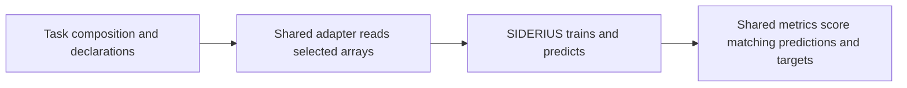

# Shared task helpers

This directory contains reusable code used by several scientific task packages.
It is **not a dataset, a separate task or a script to launch an experiment**.
To run a demo, choose a task in the [tutorial index](../../tutorials/README.md).

## Who uses these helpers?

| Helpers | What they do | Current task consumers |
|---|---|---|
| `prepared_regression.py`, `regression_metrics.py` | Read declared prepared arrays and compute global RMSE/R² from predictions and matching targets. | [Project8](../phyts_project8/README.md), [LIGO](../phyts_ligo/README.md) |
| `archive_fetch.py` | Download a missing declared archive when allowed, verify its checksum and extract it. | [Pet](../oxford_iiit_pet/README.md), [DAVIS](../davis_future_prediction/README.md) data tools |
| `artifact_io.py`, `declarations.py` | Write package artifacts and checksums; construct model-input/output and metric declarations. | Pet and DAVIS preparation tools |

The task still chooses the dataset, split, target, metric and scientific validity
checks. These helpers carry out shared mechanics; they do not select those choices
or set an experiment's iterations and resource budgets.

## One concrete example

Project8's [composition](../phyts_project8/compositions/dual_representation.yaml)
points to the shared adapter and metrics. Its own declarations supply the array
locations, shapes and data identity:

LIGO uses the same helpers with its own data and scientific declarations. Their
tutorial initializer copies this directory into your external project alongside
the selected task. Start by changing the task and experiment files shown in the
notebook; you do not need to edit shared helpers to adjust demo parameters.

## Detailed contract

The [prepared regression contract](prepared_regression.md) specifies array layout,
selection, scoring and access limitations for the Project8/LIGO adapter. For
task-specific meaning and configuration, return to the owning task's README above.
