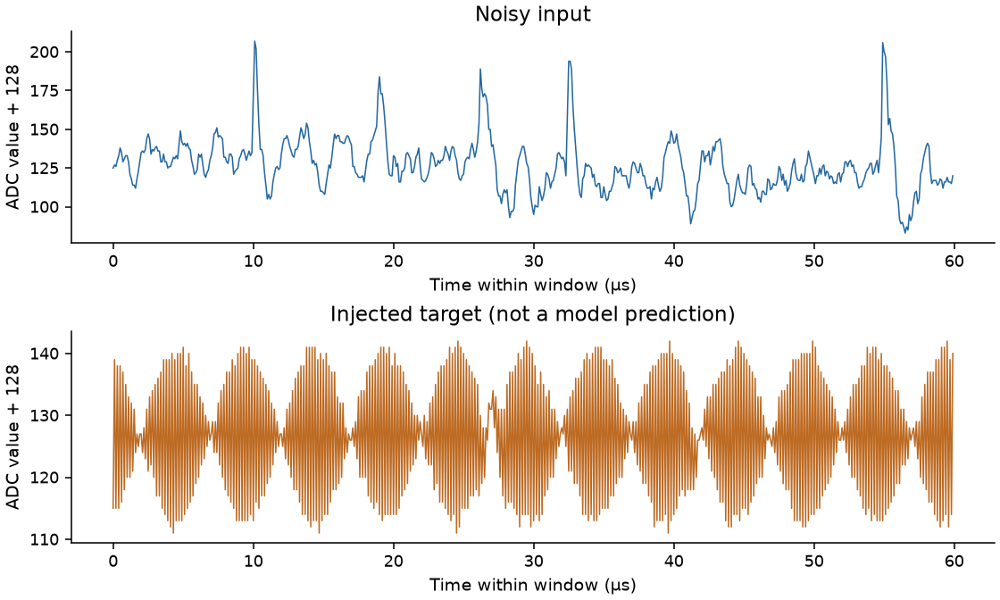
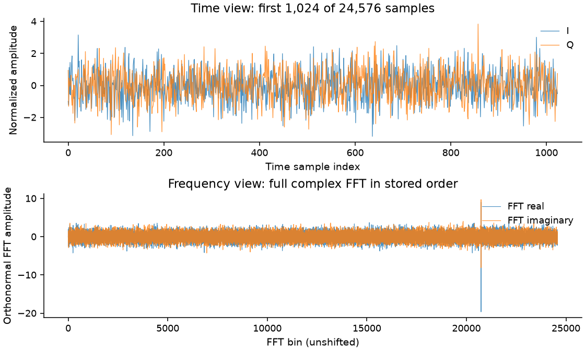
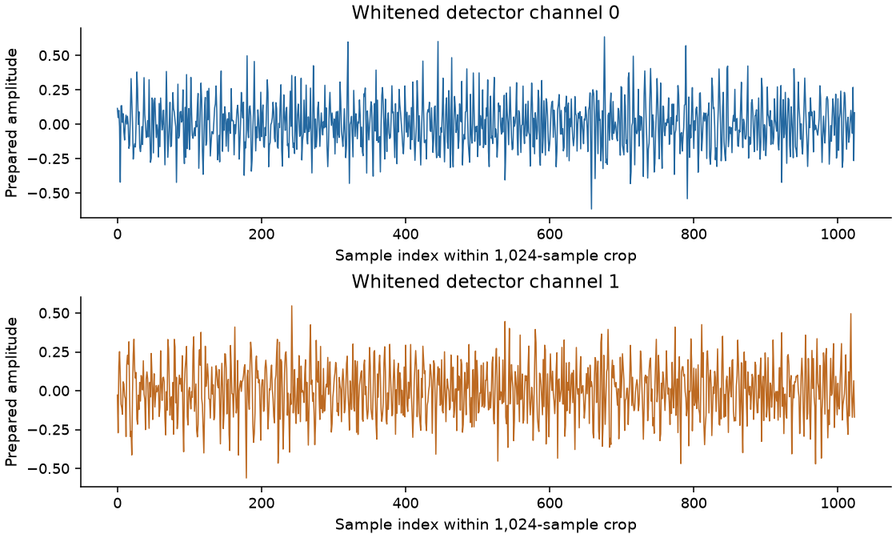
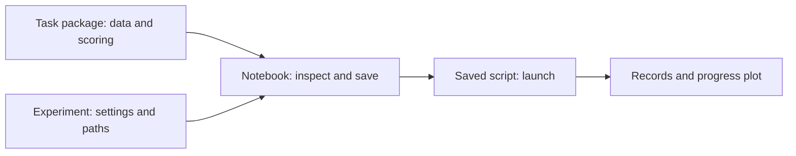

# Explore the four paper tasks with small demos

Choose a task below. Each guide helps you create an external project, inspect
real data, save an experiment, run three search iterations and plot the results.
**Start with TESS** if you are new: its data download is small.

These are process demonstrations, **not one-click paper artifact reproductions**.
They teach configuration and execution, not how to obtain the paper's scores.

## Choose by the data you want to work with

The pictures show genuine training examples. They are inputs/targets, not model
predictions. Open a notebook to see its recorded result plot before installing.

| TESS: stellar brightness → rotation frequency | TIDMAD: noisy waveform → injected signal |
|---|---|
|  |  |
| **[TESS setup](tess/README.md)** · [Notebook](notebooks/01_tess_tutorial.ipynb) | **[TIDMAD setup](tidmad/README.md)** · [Notebook](notebooks/02_tidmad_tutorial.ipynb) |

| Project8: time/frequency signals → electron energy | LIGO: two detector channels → chirp mass |
|---|---|
|  |  |
| **[Project8 setup](prepared/README.md)** · [Notebook](notebooks/03_project8_tutorial.ipynb) | **[LIGO setup](prepared/README.md)** · [Notebook](notebooks/04_ligo_tutorial.ipynb) |

[Recorded examples](examples/README.md) document all four figures, measured
scores and source identities. TIDMAD uses one band; Project8/LIGO use small
selected event populations. Their guides explain those boundaries.

## What happens when you follow a notebook?

The **task package** defines what to predict and how to score it. The
**experiment** selects that task and sets iterations, budgets, data fractions
and LLM routes. The **notebook** explains and saves these choices. The
**script** reads the saved files and launches SIDERIUS.

Each iteration proposes a candidate model. **Trial** tries training settings;
**Formal** evaluates the chosen configuration with its declared data and budgets.
Both are search stages that use workflow validation, not an untouched final test.

For example, changing three iterations to four changes an experiment. Changing
which stars belong in validation changes the task and requires matching data.
All edits belong in your external project, not in either source repository.

## Follow one route from setup to results

1. **Open your task's setup guide above.** It links the shared installation,
   then supplies its project initializer, data preparation and notebook kernel.
2. **Quick A saves and reviews the inputs.** Inspect the named JSON, task,
   LLM configuration, script and output workspace. Resolve missing prerequisites.
3. **Quick B runs that saved script.** Run All reaches this paid API/GPU step.
   Set `RUN_QUICK_DEMO=False` for an offline walkthrough; preparation may still
   write configuration files. Do not launch the same experiment twice.
4. **Quick C plots actual records.** PNG, SVG and CSV go under your project's
   `plots/`. An unchanged completed demo reuses its recorded results.
5. **Change a saved experiment deliberately.** TESS/TIDMAD have an optional
   “Change the demo you just ran” lesson after Quick C. Other parameter and
   split lessons remain opt-in. Use a fresh run identity for changed inputs.

Before downloading data, read the [hardware requirements](../shared/hardware/README.md).
Training requires a supported NVIDIA GPU and working resource accounting.
CPU/Intel training is unsupported; AMD/ROCm is experimental and currently lacks
required accounting. New projects use the [Luna test profile](../shared/README.md);
keys belong in the launching environment. Neither model choice nor a per-attempt
training budget imposes a whole-run API spending cap.

## Read results without overstating them

A completed process need not produce a scientifically valid model. **Health
checks** are task-defined tests that can reject an output, such as nearly constant
predictions, even when training succeeded. Invalid scored attempts remain hollow
points; missing scores are not invented zeros.
TESS/TIDMAD evaluate task Health checks. Project8/LIGO declare no task-specific
Health checks, so filled points there mean successful scored execution, not
Health PASS. The current-best line can include invalid raw scores.

Validation guides the agent. **Formal is a search stage, not an untouched final
test.** TIDMAD's separate optional seal/final-test lesson is disabled by default
and has not completed successful end-to-end qualification. The quick demo does
not automatically select or evaluate a final-test candidate.

The archived runs retain their original models and settings; new Luna routing
does not relabel those results. See the [paper artifact reference](../../experiments/paper-artifacts.md)
for original campaigns, frozen configurations and available reproduction evidence.

## Deeper references

- [Shared environment and key setup](../shared/setup/README.md)
- [Notebook index](notebooks/README.md) and [recorded examples](examples/README.md)
- [TESS templates](configs/README.md) and [runner wrapper](scripts/README.md)
- [Technical ownership and execution contracts](implementation.md)

Install environments and configure credentials with the [shared setup guide](../shared/setup/README.md).

GPU selection and resource checks live in the [hardware guide](../shared/hardware/README.md).
