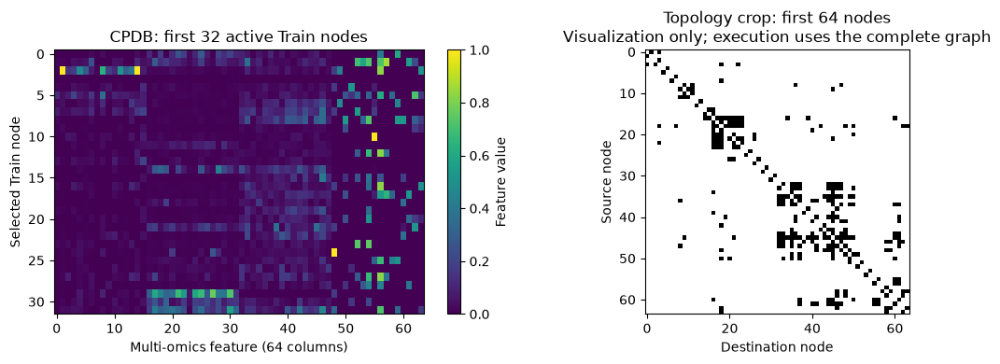
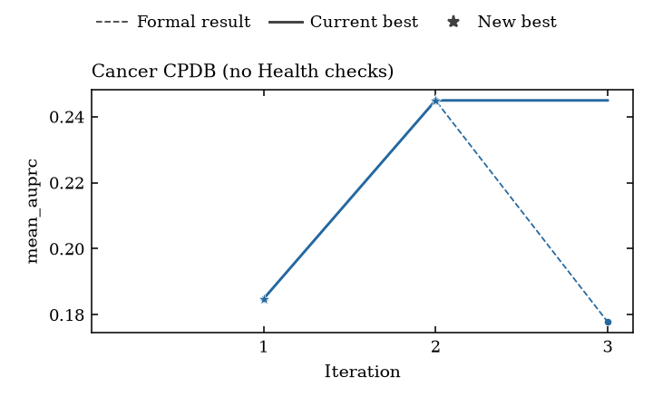

# Recorded Cancer CPDB demo

This three-iteration process demo used the real CPDB graph, GPT-6 Luna and an
RTX 5090. It completed the notebook → saved script → native results → score plot
workflow. This is supplementary teaching evidence, not a paper artifact,
eight-network benchmark, clinical predictor or promised score. The
[provenance receipt](provenance.json) identifies the executed source and data.

## See what one sample contains

One sample is the complete CPDB graph: 13,627 nodes, 64 node features and 504,378
non-self directed edges. The preview displays selected features and connections
for readability; it does not define a smaller training graph. The task packs
node and edge records into `[518005, 68]`. This is a CPU data visualization,
not a generated prediction or training-quality claim.

The original masks supply 2,013 Train labels and 224 Validation labels. All were
active in this run. The 746 reserved Test labels were not loaded or scored.
Reducing an active-label fraction changes supervision or scoring labels, not
full-graph memory or message passing.

## Read the recorded scores

| Iteration | Trial average precision | Formal average precision | Recorded execution |
|---|---:|---:|---|
| 1 | 0.5334 | 0.1848 | Successful |
| 2 | 0.3091 | 0.2449 | Successful |
| 3 | 0.5733 | 0.1779 | Successful |

The plot uses Formal records only. For this single network, `mean_auprc` is
CPDB validation average precision. Validation guides the search; this is not
final blind Test performance. Trial and Formal are separate recorded attempts;
the tutorial demonstrates their execution, not a controlled quality comparison.
The chart's “Current best” line is the best displayed diagnostic score, not an
authoritative scientific chain incumbent. It can stay flat while individual
iterations get worse.

No task **Health checks** are declared or evaluated. Filled markers and CSV
`validity=pass` mean successful scored execution, not Health PASS. The manifests
retain diagnostic result authority. Failed scored Formal attempts would appear
hollow; failures before a score exists are not invented zero-score points.

The [CSV](score-versus-iteration.csv) preserves native scores and statuses with
project-relative source paths. An [SVG](score-versus-iteration.svg) is also
available. Your notebook plots your own records, not these example numbers.

## What happened during execution

Each first generated model accepted only batch size 1. Training does use one
whole graph per batch, but the declared forward interface has a symbolic batch
dimension `B`. The native deterministic shape test supplies `B=2`; the generated
models initially rejected that valid interface test. The workflow's automatic
implementation retry corrected each model, after which all six Trial/Formal
phases succeeded. There was no manual model/source repair or score-driven rerun.
The failed implementation checks are distinct from scored training attempts.

The full notebook command took about 17.4 minutes, including API waiting. It
made 42 settled API requests, accounted at about $0.07, with no unknown-cost
requests. Repeating Run All reused the saved result without new API requests
and preserved the completion receipt. Total command time including reuse was
about 17.7 minutes; that is a conservative upper bound, not measured GPU
utilization or a spending cap enforced by the public notebook.

This validates one source/data/hardware sequence, not every generated model or
GPU. Follow the [setup guide](../README.md) to create your own external project.
Initialization clears these archived images before your own run.
