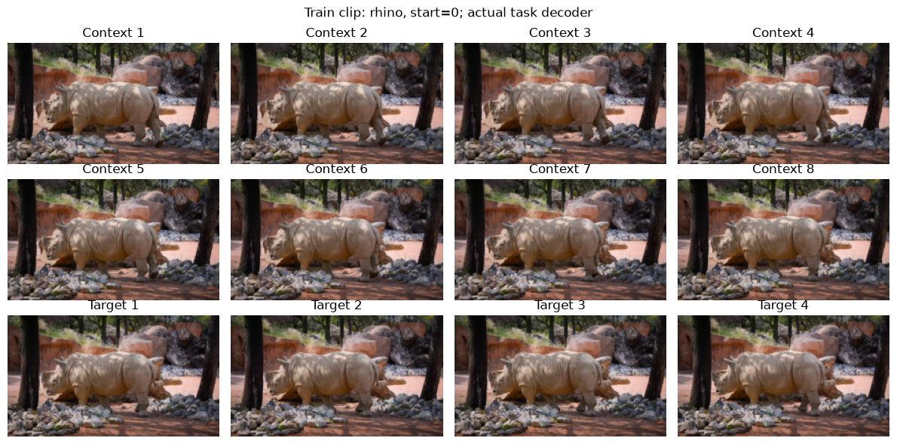
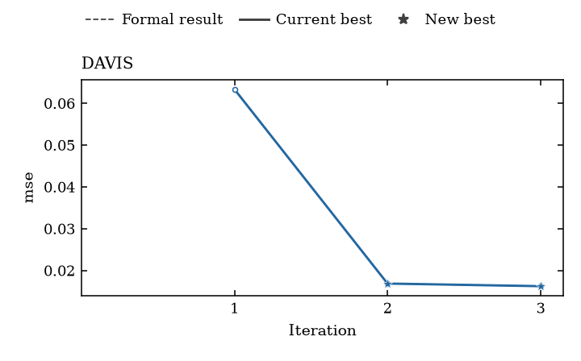

# Recorded DAVIS demo

This three-iteration process demo used real DAVIS clips, GPT-6 Luna and an
RTX 5090. It completed the notebook → saved script → native records → score plot
workflow. The first candidate failed the original Health check; the next two
passed. These outcomes are retained as teaching evidence, not a paper artifact,
video-generation benchmark or promised score. The [provenance receipt](provenance.json)
identifies the source, data and settings actually used.

## See one input and its target

This is the first clip from the original Train sequence `rhino`. The first
eight images are the model input; the last four are ground-truth targets,
**not generated predictions**. The real task decoder resizes RGB images to
128 × 224 and scales pixels to [0,1], yielding input `[3,8,128,224]` and target
`[3,4,128,224]`. This CPU preview establishes what one sample contains.

The original split stays 60 Train / 15 Validation / 15 Final sequences. The
bounded demo uses one first-window clip per sequence. Each Trial selects 15
training clips; each Formal selects 30. Both score all 15 Validation clips.
The 15 Final clips are not loaded or scored. Selection is separate from batching:
with `drop_last=true`, a partial final training batch can be omitted. The
receipt records the actual phase scopes and batch sizes.

## Read the recorded scores

| Iteration | Trial MSE | Formal MSE | Original Health check |
|---|---:|---:|---|
| 1 | 0.06454 | 0.06336 | Failed in both phases |
| 2 | 0.01772 | 0.01687 | Passed in both phases |
| 3 | 0.01932 | 0.01625 | Passed in both phases |

The plot uses Formal **MSE: lower is better**. Training uses exact-L1; MSE is
the primary evaluation metric, with PSNR and MAE also recorded. Validation
feeds the search, so these are not blind Final-set scores. Trial and Formal
are separate attempts, not a controlled quality comparison.

The first candidate's output dispersion was below the unchanged Health floor
of 0.04: Trial 0.02013 and Formal 0.03889. Native records mark both attempts
`failed_mode_collapse`, and the Formal point is hollow. Its manifest says
`no_records` because no valid winner was selected; the raw scored attempts
still exist and remain visible. The other two manifests say `completed`.
No gate was weakened, no outcome removed and no extra run requested for a
better score.

“Current best” follows the best displayed raw score, including invalid scored
candidates. It is not the native scientific chain incumbent or proof of
validity. This demo retains diagnostic result authority. Filled points here
mean successful scored execution with passing task Health checks; failures
without scores would not be invented zero-score points.

The [CSV](score-versus-iteration.csv) retains native numbers and statuses with
project-relative source paths. An [SVG](score-versus-iteration.svg) is also
available. Your notebook plots your own records, not these example numbers.

## What the run demonstrated

All three first implementations passed native validation, without implementation
retries or manual model repairs. The workflow kept the first candidate's Health
feedback and continued to the next iteration as designed. The saved native
TrialConfig and task scope record which data each attempt actually used;
reflector prose is not an execution receipt. This gallery uses those saved
records, including the Formal fraction of 0.5 and its 30 selected clips.

The full notebook command took about 12.6 minutes, including API waiting, with
31 settled API requests accounted at about $0.05 and no unknown-cost requests.
Repeating Run All reused the saved result without new API requests and preserved
the completion receipt. Total command time including reuse was about 12.7 minutes;
this is a conservative upper bound, not measured GPU utilization or a spending
cap enforced by the public notebook.

This checks one source/data/hardware sequence, not every generated model or GPU.
Follow the [setup guide](../README.md) to make an external project. Initialization
clears the archived notebook images before your own run.
