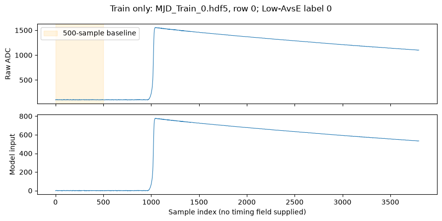
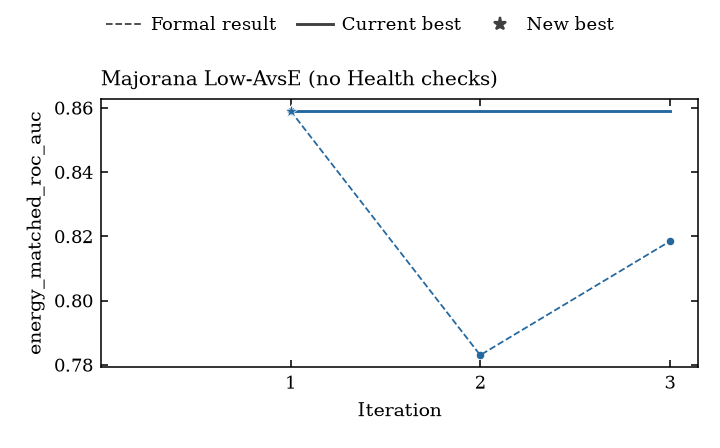

# MJD waveform-classification tutorial

Use local Majorana Demonstrator data to inspect real waveforms, edit a saved
experiment, run three research iterations through a shell script, and plot
recorded AUC scores. Open the [notebook](mjd_tutorial.ipynb) for the ordered
walkthrough. Your editable task, notebook, routing and experiment live in a new
external project; the repositories and raw data stay unchanged.

The [recorded three-iteration demo](example/README.md) shows real input waveforms,
measured scores and exact execution provenance. It completed with the Luna test
configuration on an RTX 5090; no particular score or performance is promised.
Default notebook Run All includes an explicitly labeled API/GPU cell; set
`RUN_QUICK_DEMO=False` to keep execution offline. This supplementary tutorial
is not a paper reproduction.





These are archived example outputs. Initialization clears them from your copied
notebook, which then inspects your own data and plots your own run. The waveform
is a CPU data preview; the score chart comes from actual training records.

The model receives one `[1,3800]` waveform and predicts rejection/acceptance by
the Low-AvsE cut. The task normalizes using the first 500 samples and balances
classes in fixed 25-keV energy bins. Energy and identifiers never enter the
model. **Official Train feeds training; official Test feeds evaluation during
agent search. Test is not a blind final holdout.** This tutorial preserves the
existing split and does not offer a resplit recipe.

## 1. Install the paired environments

Replace these absolute example paths with your own. Clone the public repositories,
then bind the framework to the exp checkout's exact pin:

```bash
git clone https://github.com/yuema137/siderius-exp.git /absolute/path/siderius-exp
git clone https://github.com/yuema137/SIDERIUS.git /absolute/path/SIDERIUS
cd /absolute/path/siderius-exp
uv sync --python 3.12 --group dev --group tutorial --frozen
git -C /absolute/path/SIDERIUS checkout "$(cat SIDERIUS_REVISION)"
cd /absolute/path/SIDERIUS
uv sync --python 3.12 --group dev --frozen
```

Each checkout uses its own `.venv`; do not borrow an environment or add another
checkout through `PYTHONPATH`. New projects copy the [GPT-6 Luna test routing](../../shared/README.md),
including the native planner strategy. Preflight compares source and strategy
identities in both interpreters. This routing is not a whole-run budget cap.

Offline inspection and waveform plotting need no GPU or credentials. Live
training needs a supported NVIDIA/CUDA environment; choose one visible logical
GPU with `CUDA_VISIBLE_DEVICES` on multi-GPU hosts. `gpu: null` accepts its
detected name; a string requires that name. Initial Trial/Formal VRAM budgets
are 10 GiB and must fit the card. The [shared GPU checks](../../shared/gpu-runtime.md)
own backend support and admission; a successful preview is not a GPU test.

## 2. Reuse data, or acquire the official files once

Bind an existing external dataset directory directly. The initializer neither
copies nor downloads data. On another machine, download the supervised files
from the [official Majorana Zenodo release](https://zenodo.org/records/8257027):
`MJD_Train_0.hdf5` through `MJD_Train_15.hdf5` and `MJD_Test_0.hdf5` through
`MJD_Test_5.hdf5`. Place all 22 files together. The three `MJD_NPML_*` files
are unlabeled and are not needed. The supervised files total 43,535,055,168 bytes
(about 43.5 GB / 40.5 GiB). Do not download a second copy if you already have them.

Verify the download explicitly with the task-owned checker:

```bash
cd /absolute/path/siderius-exp
.venv/bin/python -B tasks/majorana_low_avse/tools/verify_dataset.py \
  /absolute/path/data/MAJORANA \
  tasks/majorana_low_avse/declared/dataset_manifest.json --supervised-only
```

Success prints `Majorana dataset verification passed: 22 file(s)`. Verification
reads all supervised bytes. Launch repeats it; preview checks names and sizes
only. Do not edit checksums to make a damaged download pass. The tutorial rejects
a copied dataset manifest that differs from the task's official manifest.
Smaller fractions reduce selected waveform/training work, not the required files
or the task loader's complete-partition metadata reads.

## 3. Initialize an external project

```bash
cd /absolute/path/siderius-exp
.venv/bin/python -B -m tutorials.supplementary.mjd.project \
  --project /absolute/path/my-mjd-project \
  --infra-checkout /absolute/path/SIDERIUS \
  --data-dir /absolute/path/data/MAJORANA
```

Choose a new directory outside the repositories and raw data. The initializer
refuses existing destinations. It creates these editable inputs:

| Path inside your project | Owner and purpose |
|---|---|
| `tasks/mjd/compositions/low_avse.yaml` | Selects task data, metric and model contracts |
| `tasks/mjd/declared/` and `tasks/mjd/plugins/` | Official data identity and scientific implementation |
| `experiments/mjd-demo.json` | Absolute paths, iterations, epochs, fractions and resource allowances |
| `experiments/workflow.json` | Fixed workflow; saved experiment overrides exposed knobs |
| `llm/agents.json` | Model/provider/planner routing, never secrets |
| `scripts/run-mjd.sh` | Saved shell entrypoint bound to the experiment JSON |
| `notebooks/mjd_tutorial.ipynb` | Your editable walkthrough |
| `runs/`, `plots/` | Fresh run workspaces and exported results |

The project root holds inputs; `workspace` names one fresh output directory
under `runs/`. They are different locations. Full dataset bytes remain at
`data_dir`. Generated code, calibration and checkpoints belong to the run.

Export required API keys from a trusted external mode-600 credential file in
the terminal that starts Jupyter or the script. For the initial OpenAI routing
that means `OPENAI_API_KEY`. Never put secret values in notebooks, JSON or
scripts. If your routing changes, preview reports its enabled provider key
names and presence, not values or proof of authentication.

Register this checkout's kernel externally and start Jupyter at the project:

```bash
export EXP_CHECKOUT="/absolute/path/siderius-exp"
export TUTORIAL_HOME="/absolute/path/my-mjd-project"
"$EXP_CHECKOUT/.venv/bin/python" -m ipykernel install \
  --prefix "$TUTORIAL_HOME/.jupyter" --name siderius-mjd \
  --display-name "SIDERIUS MJD tutorial"
export JUPYTER_PATH="$TUTORIAL_HOME/.jupyter/share/jupyter${JUPYTER_PATH:+:$JUPYTER_PATH}"
export IPYTHONDIR="$TUTORIAL_HOME/.ipython"
export MPLCONFIGDIR="$TUTORIAL_HOME/.matplotlib"
export JUPYTER_RUNTIME_DIR="$TUTORIAL_HOME/.jupyter/runtime"
cd "$TUTORIAL_HOME"
"$EXP_CHECKOUT/.venv/bin/jupyter" lab --ServerApp.root_dir="$TUTORIAL_HOME"
```

Open `notebooks/mjd_tutorial.ipynb` and select **SIDERIUS MJD tutorial**. The
notebook reads `TUTORIAL_HOME/project.json` and checks its own interpreter;
it works independently of Jupyter's initial working directory. Restart Jupyter
from the correct terminal after changing keys or these environment bindings.

## 4. Inspect, save changes, and run

The initial experiment requests three iterations, two tuner rounds (Trial then
Formal), a one-epoch ceiling, Trial/Formal training fractions `.01`/`.01`, and
both evaluation fractions `.01`. All training fractions precede exact class
balancing. Per-epoch thinning is fixed at `train_portion=1`. The notebook calls
the selected loader for actual illustrative counts instead of multiplying a
historical full-population count. These counts depend on sampling seed. All four exposed fractions must be between
`.01` and `1`, matching the native workflow parser; values below one percent are
rejected when saving, before any launch.

Initial training allowances are 2/5 minutes and 10 GiB per Trial/Formal attempt.
They are experiment settings, not framework defaults, runtime predictions or
total API/GPU caps. Data Analysis, literature review and human advice are disabled.
The task explicitly has no Health checks; native resource/scoreability checks
remain active. The workflow uses diagnostic result authority.

Default notebook behavior reloads your saved JSON. For a fresh variant, enable
`SAVE_VARIANT`, choose `VARIANT_NAME="mjd-four-001"` and set
`CHANGES={"iterations": 4}`. This writes a new JSON and `scripts/run-mjd-four-001.sh`
with a fresh workspace, preserving the original. Budget and fraction examples
appear beside the knob table. Disable the save switch after using it, then select
that saved name in section 1. Saving changes performs no training.

The **initial `experiments/mjd-demo.json`** can also be run from any directory
using the commands below. For a saved variant, use its exact script shown by the
notebook review (for example `scripts/run-mjd-four-001.sh`); `run-mjd.sh` always
reads the initial JSON:

```bash
bash /absolute/path/my-mjd-project/scripts/run-mjd.sh
bash /absolute/path/my-mjd-project/scripts/run-mjd.sh --dry-run
# API/GPU effects; review the saved file and resource authorization first:
bash /absolute/path/my-mjd-project/scripts/run-mjd.sh --launch
```

The first two commands stay offline. `--dry-run` also asks the native launcher
to render its command. `--launch` checks the selected setup and all official
MD5 values before running. Notebook section 5 invokes this same saved script;
set `RUN_QUICK_DEMO=False` to skip it. `RUN_NATIVE_PREVIEW=False` separately
skips native preview for a file-only walkthrough. When the selected workspace
already exists, the notebook skips native launch preview and lets section 5
check cache reuse; it does not try to launch into an existing directory.

## 5. Recognize outputs and recover without relaunching

Inspect the console log and native per-iteration records, not only a process
exit code. Notebook execution keeps `.console.log` and `.notebook-run.json`
beside the workspace; the script writes a `.tutorial.json` launch receipt.
Completed unchanged notebook runs reuse their result. Changed linked inputs or
source identity require a fresh name; interrupted/failed runs keep evidence and
refuse automatic relaunch. The timeout stops the owned process tree, but does
not implement a billing/GPU accounting cap.

Set `PLOT_EXPERIMENT` and run notebook section 6 alone to plot an existing run.
It needs the saved JSON/composition and native records, not data or credentials.
PNG/SVG/CSV exports preserve actual Formal scores and status, including failed
scored attempts and missing values. With no finite Formal scores, the helper
reports that no chart can yet be drawn; it does not fabricate zero scores.
Filled markers indicate successful scored execution for this no-Health task,
**not measured Health PASS**. An improving line is not guaranteed and does not
certify a model or a blind final-test result.

See the [task](../../../tasks/majorana_low_avse/README.md) for scientific details,
[implementation contract](implementation.md) for boundaries and validation,
and [tutorial index](../../README.md) for other tasks. Historical MJD experiment
profiles and receipts retain their own identities; they are not this demo's results.
