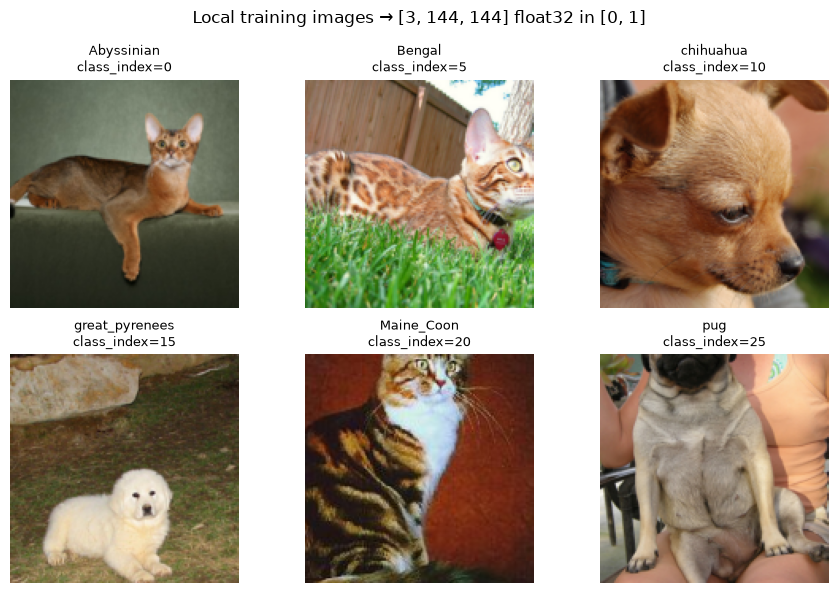
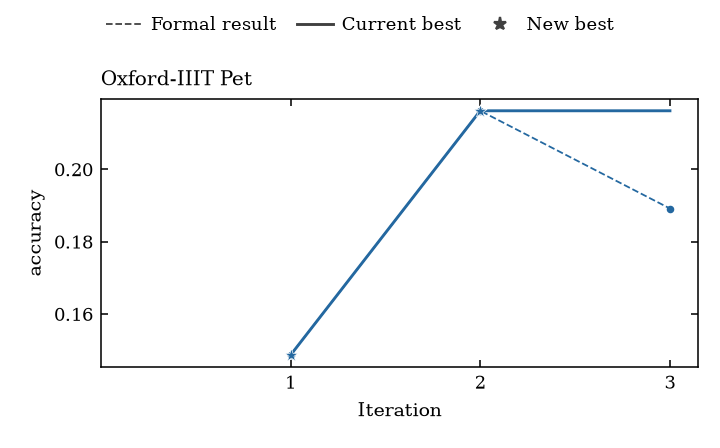

# Pet image-classification demo

New projects use the [shared GPT-6 Luna test configuration](../../shared/README.md) for all
workflow LLM stages. It is independent of paper routing. Recorded figures below
come from earlier runs and do not establish live Luna compatibility.

Learn how a task package turns JPEG images into a classification problem, change
an experiment, run three research iterations, and plot the measured scores.
This supplementary example uses Oxford-IIIT Pet; it is **not a paper artifact,
benchmark, or promise of Health PASS**.

Open the [notebook](pet_tutorial.ipynb) to see the complete sequence. Your notebook
edits files in a new external project; your saved shell script launches SIDERIUS.
The repositories remain unchanged.

## 1. Install the exact environments

Clone the public repositories into separate directories. Replace the example
paths with your own absolute paths throughout these instructions.

```bash
git clone https://github.com/yuema137/siderius-exp.git /absolute/path/siderius-exp
git clone https://github.com/yuema137/SIDERIUS.git /absolute/path/SIDERIUS
cd /absolute/path/siderius-exp
uv sync --python 3.12 --group dev --group tutorial --frozen
git -C /absolute/path/SIDERIUS checkout "$(cat SIDERIUS_REVISION)"
cd /absolute/path/SIDERIUS
uv sync --python 3.12 --group dev --frozen
```

Each checkout uses its own `.venv`. Pet explicitly selects the built-in
`native-timing-v1` planner. Preflight compares the planner identities resolved in
both environments and rejects missing or mismatched providers. Fresh tutorial
projects select this native planner; archived paper treatments retain
their historical settings. Model routing and historical replay are separate choices.

The launcher uses the one visible logical GPU in the selected framework
installation. Set `gpu` to `null` for automatic name selection, or keep a string
as a required name expectation. NVIDIA models have no name whitelist. On a
multi-GPU host, select one card with `CUDA_VISIBLE_DEVICES` before launch. Set
Trial/Formal VRAM budgets below its capacity; the tiny kernel check does not
prove a generated model will fit.

AMD/ROCm compatibility is experimental and untested; required driver/process
accounting is not implemented, so this tutorial currently refuses that path.
Intel GPU and CPU training are unsupported. Keep the frozen installation and
required protection intact; no ROCm installation profile is qualified here.
The [current source-pair qualification](../../../provenance/validation/2026-10-08_v1_metadata/receipt.json)
records the pinned framework and offline installation/compatibility checks.
It does not establish a fresh Pet run with Luna or fresh GPU qualification;
the archived run below retains its original model and source provenance. A framework missing the
discovery API refuses launch rather than borrowing another checkout's environment.

### Check hardware before paid execution

The default demo uses an 8 GiB VRAM allowance. Available room and deployment
limits must accommodate that allowance as well as current device occupancy; a
card's advertised capacity alone is insufficient. CPU training is unsupported.
See the [hardware guide](../../shared/hardware/README.md) for this task's data,
host-RAM and storage considerations, supported backends and failure remedies.

After creating your external project below, check its saved settings without API
keys or training:

```bash
cd "$EXP_CHECKOUT"
.venv/bin/python -m tutorials.shared.hardware \
  --experiment "$TUTORIAL_HOME/experiments/pet-demo.json"
```

For a variant, use its own saved JSON. This hardware-only check creates no run
workspace and does not validate every task setting. Fresh launches repeat the
GPU check; later native measurement still decides whether a generated model fits.

## 2. Download the images

Use the task-owned helper to download and verify the official image and
annotation archives, then extract them outside the repositories:

```bash
export PET_DATA="/absolute/path/data/OXFORD_IIIT_PET"
cd /absolute/path/siderius-exp
.venv/bin/python -m tasks.oxford_iiit_pet.tools.fetch_oxford_iiit_pet \
  --dest "$PET_DATA" --extract
```

The input directory is `$PET_DATA/images/`, containing files such as
`Abyssinian_100.jpg`. Pass that directory to `--images` below; the initializer
saves it as experiment `data_dir` without copying or downloading JPEGs. See the
[shared directory guide](../../README.md#source-project-data-and-run-directories)
for the distinction from your project and run outputs.

Keep this completed download for later runs. The demo checks every declared
image filename and decodes search images before launch; final-set pixels never
enter search. Fix missing files before running the notebook's image preview.

## 3. Initialize your project and export keys

```bash
cd /absolute/path/siderius-exp
.venv/bin/python -m tutorials.supplementary.pet.project \
  --project /absolute/path/my-pet-project \
  --infra-checkout /absolute/path/SIDERIUS \
  --images "$PET_DATA/images"
```

Choose a new project outside both repositories and the dataset. Initialization
refuses an existing destination. It creates:

| File or directory | What you inspect or change |
|---|---|
| `tasks/pet/compositions/bounded_qualification.yaml` | Task components and train/validation CSV paths |
| `tasks/pet/data/manifests/` | Image IDs, class labels and split membership |
| `tasks/pet/declared/` | Model tensor contract, metrics and Health rules |
| `llm/agents.json` | Provider, model, reasoning effort and planner strategy; no keys |
| `experiments/pet-demo.json` | Iterations, epochs, fractions, time/VRAM and all absolute paths |
| `experiments/workflow.json` | Fixed workflow flags; experiment JSON owns the exposed knobs |
| `scripts/run-pet.sh` | Saved executable entrypoint, bound to that experiment JSON |
| `data/images.json` | Initial image-location receipt; `data_dir` in the experiment is authoritative |
| `runs/` | Fresh native workspaces, console log and completion receipts |
| `plots/` | Your exported PNG, SVG and CSV |

Export `OPENAI_API_KEY` from a trusted external secret source in the terminal
that starts Jupyter or the script. For example, source your own mode-600
credential file with `set -a; source /absolute/path/private/credentials.env;
set +a`. Never put key values in the notebook, JSON, shell script or repository.
Preflight reports only key names and whether they are present; authentication is
not proved until the service accepts a request.

Register the exact exp kernel and start Jupyter at your project root. This makes
`notebooks/`, `experiments/`, `tasks/` and `scripts/` visible in one file browser.
Run these commands in the same terminal where you exported keys:

```bash
export EXP_CHECKOUT="/absolute/path/siderius-exp"
export TUTORIAL_HOME="/absolute/path/my-pet-project"
"$EXP_CHECKOUT/.venv/bin/python" -m ipykernel install \
  --prefix "$TUTORIAL_HOME/.jupyter" --name siderius-pet \
  --display-name "SIDERIUS Pet tutorial"
export JUPYTER_PATH="$TUTORIAL_HOME/.jupyter/share/jupyter${JUPYTER_PATH:+:$JUPYTER_PATH}"
export IPYTHONDIR="$TUTORIAL_HOME/.ipython"
export MPLCONFIGDIR="$TUTORIAL_HOME/.matplotlib"
export JUPYTER_RUNTIME_DIR="$TUTORIAL_HOME/.jupyter/runtime"
cd "$TUTORIAL_HOME"
"$EXP_CHECKOUT/.venv/bin/jupyter" lab --ServerApp.root_dir="$TUTORIAL_HOME"
```

Open `notebooks/pet_tutorial.ipynb` and select **SIDERIUS Pet tutorial**. The
notebook reads `TUTORIAL_HOME/project.json` and checks the exact interpreter;
it does not infer the project from the kernel's current directory. If keys or
`TUTORIAL_HOME` change later, restart the Jupyter server from this terminal.

## 4. Edit, review, then run

Follow the notebook in order. It shows transformed images and manifests before
asking you to edit settings. Initial values are three research iterations, two
tuner rounds, 32-epoch ceilings, Trial training/validation fractions of 0.5,
Formal fractions of 1.0, Trial/Formal time ceilings of 2/5 minutes and 8 GiB VRAM.
These are demo settings, not framework defaults or expected runtimes.

Default Run All **reads your saved JSON without rewriting its settings**. Keep
`SAVE_VARIANT=False` for the initial run. To adjust the initial run before launch,
edit `experiments/pet-demo.json` in Jupyter and rerun the inspection cell.
To preserve an earlier run, set `SAVE_VARIANT=True`, choose a fresh name such as
`pet-more-001`, and set `CHANGES={"iterations": 4}`. This creates:

```text
experiments/pet-more-001.json      new settings; original JSON retained
scripts/run-pet-more-001.sh        reads that exact JSON
runs/pet-more-001/                 created only by launching that script
```

The remaining cells select this new pair. After saving once, set
`SAVE_VARIANT=False` and set `SELECTED_EXPERIMENT="pet-more-001"` in the first
cell before the next Run All. Reusing a save name is refused. Review and launch
both verify the script's literal experiment, exp-checkout and runner bindings.
The check detects an accidentally mismatched script; it does not certify arbitrary
shell code. The optional split exercise also saves a separate named experiment
and script, preserving the original files.

There are 370 training, 74 validation and 370 independent final images. Validation
feeds the agent; final is not run here. Pet requires `train_portion=1`, disabling additional per-epoch subsampling.
Trial/Formal fractions choose the attempt scope first. The generated training
configuration still controls batching; `drop_last=True` omits an incomplete last
batch. Inspect its saved config and loader counts for exact samples per epoch. The optional notebook resplit example saves a **new** task with
333 training and 111 validation images while preserving final membership.

For the **initial `pet-demo.json` experiment**, inspect all saved values and
execute the preview below. If you selected a named variant, use the exact
preview/launch commands printed by the notebook review instead; `run-pet.sh`
continues to select the initial JSON.

```bash
bash /absolute/path/my-pet-project/scripts/run-pet.sh
```

It prints the native command, exact revisions, strategy identity, split counts,
selected input identities and required key presence. It makes no API calls or CUDA allocation.
A missing dataset, dirty/mismatched checkout or incomplete environment produces
an error before execution. To also check native launcher argument parsing:

```bash
bash /absolute/path/my-pet-project/scripts/run-pet.sh --dry-run
```

For that initial experiment, either use Run All with
`SELECTED_EXPERIMENT="pet-demo"` or execute the same `run-pet.sh` below.
For a variant such as `pet-more-001`, run its reviewed
`scripts/run-pet-more-001.sh --launch` command instead.

Initial experiment launch:

```bash
bash /absolute/path/my-pet-project/scripts/run-pet.sh --launch
```

This performs paid LLM calls and GPU work. The notebook delegates to that command,
records a console log and stops the process group if interrupted or timed out.
Its 60-minute timeout is not a billing cap; set spending controls for your own
account. The per-attempt time/VRAM settings do not limit total API expense.

Data Analysis, literature review and human advice are disabled in this fixed
workflow. There is no workflow sandbox to configure; native generated-code
execution checks still apply.

## 5. Read your results and rerun deliberately

The initial experiment stores Formal scores under `runs/pet_demo_001/`.
Named variants use their own saved workspace; the plot cell reads the selected
`PLOT_EXPERIMENT` JSON. Filled points passed
recorded Health checks, hollow points have scores but failed checks, and attempts
without scores remain unscored. No Health PASS or high accuracy is required to
teach this workflow. A run with no measured Formal scores cannot produce a
meaningful score chart; inspect the log instead of treating it as zero accuracy.

For the initial experiment, `plots/pet_demo_001/` receives `score-versus-iteration.png`, `.svg` and `.csv`.
The notebook reuses a completed run only while all saved task/config/script inputs
match its receipt. To change parameters and run again, use the named save-as exercise above.
It sets the new run name and workspace together and retains earlier JSON/scripts.
Interrupted directories are not silently resumed.

For plotting only, set `PLOT_EXPERIMENT` to the saved JSON for the run you want
and choose `PLOT_OUTPUT`, then execute only the final plotting cell. This does
not invoke the launch cell and works with `RUN_QUICK_DEMO=False`. A missing
workspace produces guidance; a workspace without measured Formal scores reports
that condition instead of drawing zero accuracy. For offline file editing, set
both `RUN_NATIVE_PREVIEW=False` and `RUN_QUICK_DEMO=False`; local data inspection
still requires the declared images.

## Recorded example

The [qualified three-iteration example](example/README.md) includes real images,
the score chart, Trial/Formal outcomes and provenance. These pictures are also
embedded in the notebook for GitHub readers. They are demonstration outputs;
initialization clears them from your copied notebook. Executing that copy reads
your own project and produces your own results.




