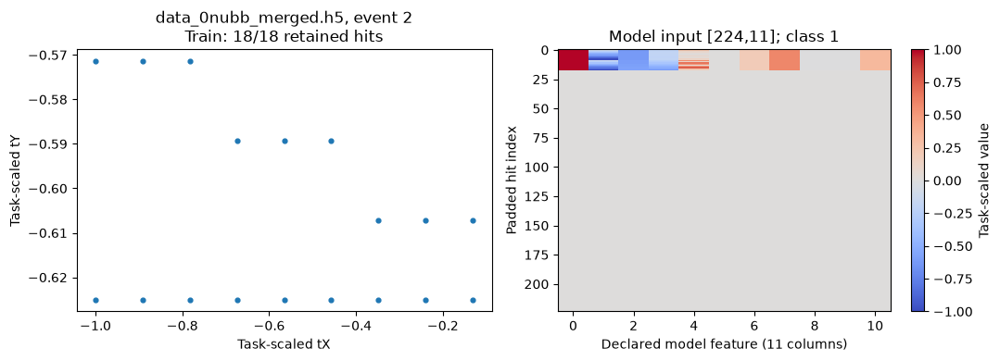
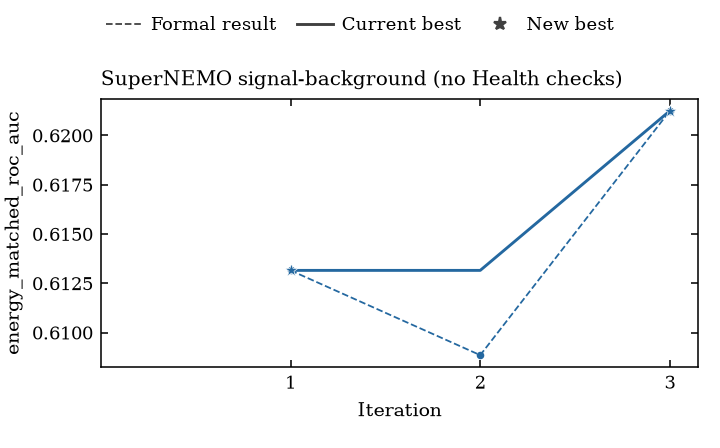

# Recorded SuperNEMO demo

This three-iteration process demo used real SuperNEMO data and GPT-6 Luna on an
RTX 5090. It completed the notebook → saved script → recorded score workflow.
It is supplementary teaching evidence, not a paper artifact or a promised score.
The [provenance receipt](provenance.json) identifies the exact executed source,
task, prepared indexes and native result records.

## Inspect one event

The CPU preview shows a real Train event, identified by its process file and
`ev_no`. Its tracker hits stay together when assigning a partition; the model
retains at most 224 hits and pads shorter inputs. The left panel uses the task's
scaled tracker coordinates. The right panel shows its actual `[224,11]` tensor.
This is data visualization, not a generated prediction or training-quality claim.

At the configured one-percent fractions, illustrative seed 42 selected 7,344
balanced training events and 970 balanced validation events. Attempt seeds can
differ. The original event split is unchanged; reserved test events were not used.

## Inspect the result

| Iteration | Trial AUC | Formal AUC | Recorded execution |
|---|---:|---:|---|
| 1 | 0.6384 | 0.6132 | Successful |
| 2 | 0.6107 | 0.6089 | Successful |
| 3 | 0.5696 | 0.6213 | Successful |

The chart plots Formal records only. This task explicitly has **no Health
checks**: filled markers and CSV `validity=pass` describe successful scored
execution, not Health PASS. Failed scored Formal attempts would appear hollow.
The line tracks the best raw score; individual iterations need not improve.
Validation scores feed the search, so they are not final-test performance.

The [CSV](score-versus-iteration.csv) preserves native values with project-relative
source paths. An [SVG](score-versus-iteration.svg) is also available. Your notebook
reads your own workspace; it never substitutes these example scores.

## What completed, and what it cost

All three iterations completed with diagnostic result authority. The notebook
command took about 15.4 minutes. The campaign made 39 API requests, accounted
at about $0.06, with no unknown-cost requests. Cumulative command time including
the cached rerun was about 15.6 minutes; it includes API waiting and is a
conservative upper bound, not measured GPU utilization or a notebook spending cap.

Native proposer retries handled structural output and an existing model name.
There was no manual model/source intervention and no rerun to improve a score.
Repeating Run All reused the saved result without new API requests and preserved
the completion receipt. This demonstrates one source/data/hardware sequence,
not every possible generated model or device.

One-time CPU data preparation was separate: it verified all four raw MD5s and
built indexes in about 3.3 minutes on this machine. Its timing is not included
in the live campaign figures above. See the [setup guide](../README.md) to reuse
local files or prepare your own external directories. Initialization clears the
archived notebook outputs before you run your own project.
